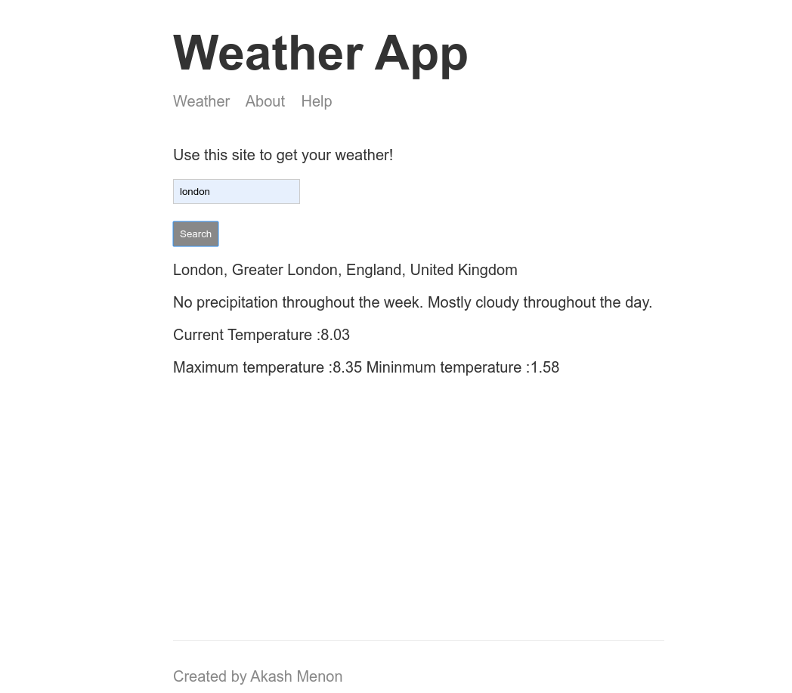

# Weather App

## A node based weather app built using express framework and handlebars based templating using hbs

## *Website* [Weather app](https://minimalist-weather-app.herokuapp.com/)

## To run locally clone or download the repo and cd into it

```
$ npm install
$ npm start
```

## darksky API has been used to fetch the weather data for a given location

### src/utils/weather.js is used to fetch the weather details

## mapbox API is used to geocode an address

### src/utils/geocode.js is used to geocode the user given address

## Dependencies

- Express 
- request
- string-format
- hbs

